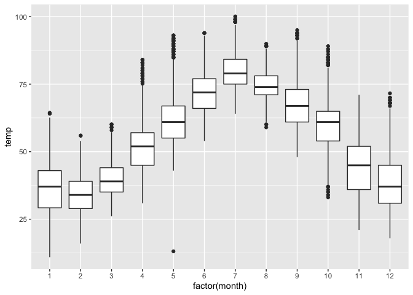

Experimenting with Websites
================

``` r
library(ggplot2)
library(babynames)
library(nycflights13)
```

## GitHub Documents

This is an *R* **Markdown** *format* used for publishing markdown
documents to GitHub. When you click the **Knit** button all R code
chunks are run and a markdown file (.md) suitable for publishing to
*GitHub* is generated.

## Including Code

You can include **R code** in the document as follows:

``` r
summary(babynames)
```

    ##       year          sex                name                 n          
    ##  Min.   :1880   Length:1924665     Length:1924665     Min.   :    5.0  
    ##  1st Qu.:1951   Class :character   Class :character   1st Qu.:    7.0  
    ##  Median :1985   Mode  :character   Mode  :character   Median :   12.0  
    ##  Mean   :1975                                         Mean   :  180.9  
    ##  3rd Qu.:2003                                         3rd Qu.:   32.0  
    ##  Max.   :2017                                         Max.   :99686.0  
    ##       prop          
    ##  Min.   :2.260e-06  
    ##  1st Qu.:3.870e-06  
    ##  Median :7.300e-06  
    ##  Mean   :1.363e-04  
    ##  3rd Qu.:2.288e-05  
    ##  Max.   :8.155e-02

## Including Plots

You can also embed plots, *for example*:

``` r
# Code from ModernDive 2.7, Figure 2.18. 
ggplot(data = weather, mapping = aes(x = factor(month), y = temp)) +
  geom_boxplot()
```

    ## Warning: Removed 1 rows containing non-finite values (stat_boxplot).

<!-- -->

Note that the `echo = FALSE` parameter was added to the code chunk to
prevent printing of the R code that generated the plot.
